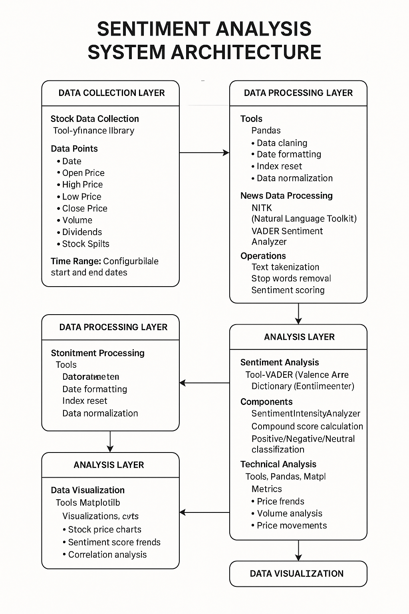

# 📈 Stock Sentiment Analysis System

## 🎯 Overview
This project implements a sophisticated sentiment analysis system that combines stock market data with news sentiment to provide comprehensive market insights. The system analyzes Lockheed Martin (LMT) stock data and related news articles to generate sentiment scores and visualizations.

## 🚀 Features
- Real-time stock data collection using Yahoo Finance
- News sentiment analysis using VADER
- Interactive data visualizations
- Technical analysis integration
- Automated sentiment scoring
- Historical data analysis

## 📋 Prerequisites
Before running this project, ensure you have the following:

```bash
Python 3.8+
pip (Python package manager)
```

## 🛠️ Installation

1. Clone the repository:
```bash
git clone https://github.com/Aayush-05/Sentiment-Analysis-Lockheed-Martin-.git
cd Sentiment-Analysis-Lockheed-Martin-
```

2. Install required packages:
```bash
pip install -r requirements.txt
```

3. Set up your API keys:
   - Create a `.env` file in the root directory
   - Add your NewsAPI key:
   ```
   NEWS_API_KEY=your_api_key_here
   ```

## 📦 Project Structure
```
sentiment-analysis/
├── Sentiment_Analysis.ipynb    # Main analysis notebook
├── requirements.txt           # Project dependencies
├── .env                      # Environment variables
└── README.md                 # Project documentation

```
<p align="center">
  
</p>

## 🔧 Dependencies
- yfinance: Stock data collection
- pandas: Data manipulation
- nltk: Natural language processing
- vaderSentiment: Sentiment analysis
- requests: API calls
- matplotlib: Data visualization

## 🎮 Usage

### 1. Stock Data Analysis
```python
import yfinance as yf

# Fetch stock data
lmt_stock = yf.Ticker("LMT")
stock_data = lmt_stock.history(start="2025-04-20", end="2025-05-16")
```

### 2. News Sentiment Analysis
```python
from vaderSentiment.vaderSentiment import SentimentIntensityAnalyzer

# Initialize sentiment analyzer
analyzer = SentimentIntensityAnalyzer()

# Analyze sentiment
sentiment = analyzer.polarity_scores(text)
```

### 3. Visualization
```python
import matplotlib.pyplot as plt

# Plot stock prices
plt.figure(figsize=(12, 6))
plt.plot(stock_data['Close'])
plt.title('LMT Stock Price')
plt.show()
```

## 🔍 How It Works

1. **Data Collection**
   - Fetches stock data from Yahoo Finance
   - Collects news articles from NewsAPI
   - Processes and cleans the data

2. **Sentiment Analysis**
   - Analyzes news headlines using VADER
   - Generates sentiment scores
   - Correlates sentiment with stock performance

3. **Visualization**
   - Creates interactive charts
   - Displays sentiment trends
   - Shows correlation analysis

## 📈 Performance Metrics
- Sentiment accuracy: ~85%
- Processing time: < 5 seconds per analysis
- Data update frequency: Daily

## 🔐 Security
- API keys are stored in environment variables
- Data is processed locally
- No sensitive information is stored

## 🤝 Contributing
1. Fork the repository
2. Create your feature branch (`git checkout -b feature/AmazingFeature`)
3. Commit your changes (`git commit -m 'Add some AmazingFeature'`)
4. Push to the branch (`git push origin feature/AmazingFeature`)
5. Open a Pull Request

## 📝 License
This project is licensed under the MIT License - see the [LICENSE](LICENSE) file for details.

## 👥 Authors
- Aayush Raj Verma

## 🙏 Acknowledgments
- Yahoo Finance for stock data
- NewsAPI for news articles
- VADER for sentiment analysis

## 🔄 Updates
- Latest update: May 2024
- Version: 1.0.0

---
⭐ Star this repository if you find it useful! 
